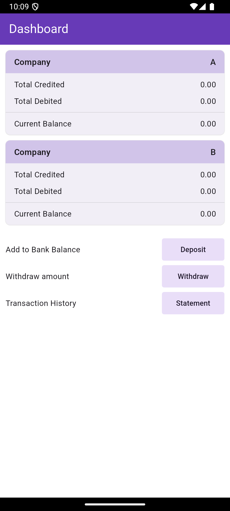
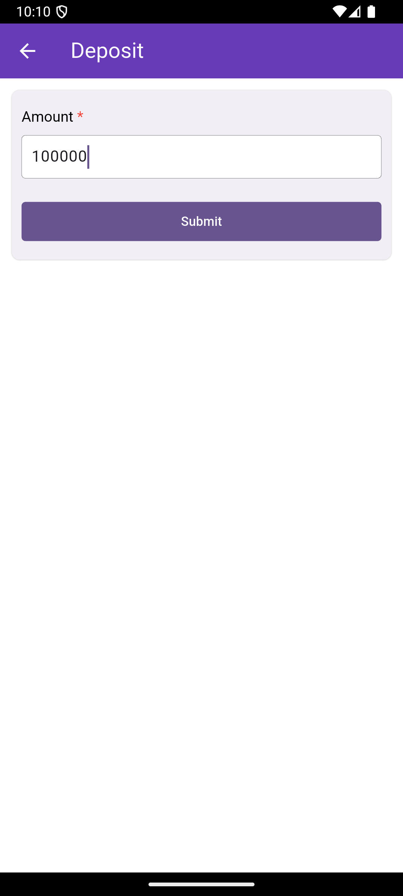
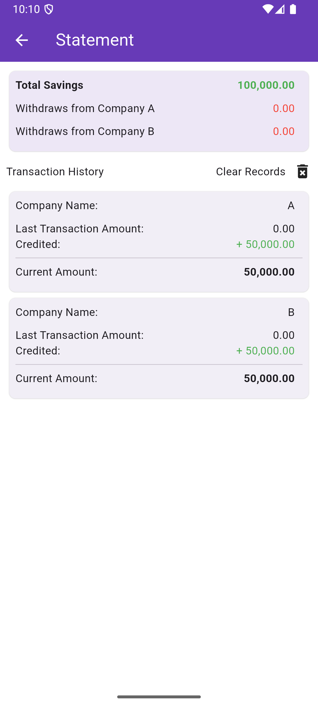
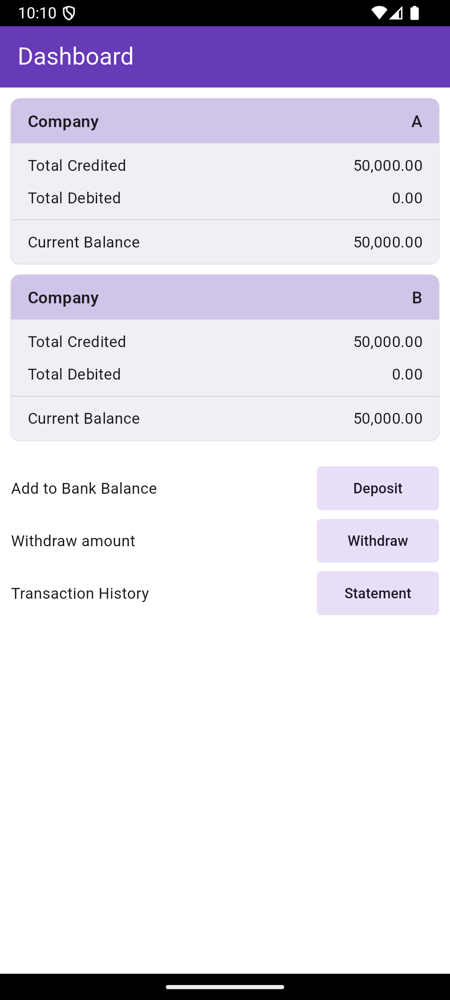
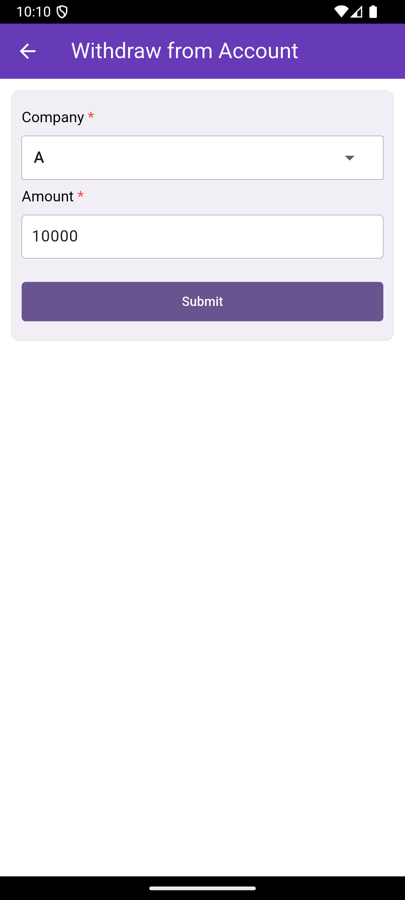
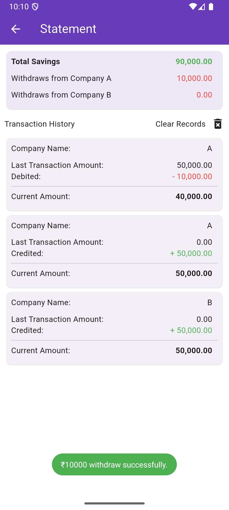

# clean_architecture_flutter

## Description

Project contains deposit, withdrawal and track history feature.
User can add deposit, withdraw with respect to the selected company type, and can able to see the
transaction history for each company records.

## Features

- Dashboard
- Deposit Amount
- Withdraw Amount
- Bank Statement/Transaction History

This project architecture uses Clean-Code Architecture pattern

- data (Data layer logic)
- domain (Interact/Business Logic)
- presentation (UI/Views/State management)

## Installation

- Flutter (3.27.2)
- Android Studio (version 2024.2) - Android Studio Ladybug Feature Drop | 2024.2.2

## Guidelines to run the project

Hit Command in Terminal: flutter pub run build_runner build

## Developer approach

Hi Team, I have use clean architecture with Bloc state management

- BLOC: Used bloc for better clean coding with freezed class
- For now i am not using use case in domain layer. Going with MVVM
- Used **get_it** for dependency injection
- **go_router** for Navigation
- **dartz** library for handling try catch using fold function
- **flutter_toast** for showing toast messages
- **sqflite** for persistent database
- **path_provider** for saving db in storage
- **intl** for decimal formatting

## Screen shots

Example Scenario

1) The user enters 100,000 as annual savings.
2) The system splits it into CompA: 50,000 and CompB: 50,000.
3) The user withdraws 10,000 from CompA.
4) The main screen updates:
   a) CompA: 40,000
   b) CompB: 50,000
5) The user checks history and sees:
   a) Year 2025: Savings - 100,000, Withdrawn - 10,000 (CompA)

{width=300 height=600}

{width=300 height=600}

{width=300 height=600}

{width=300 height=600}

{width=300 height=600}

{width=300 height=600}

